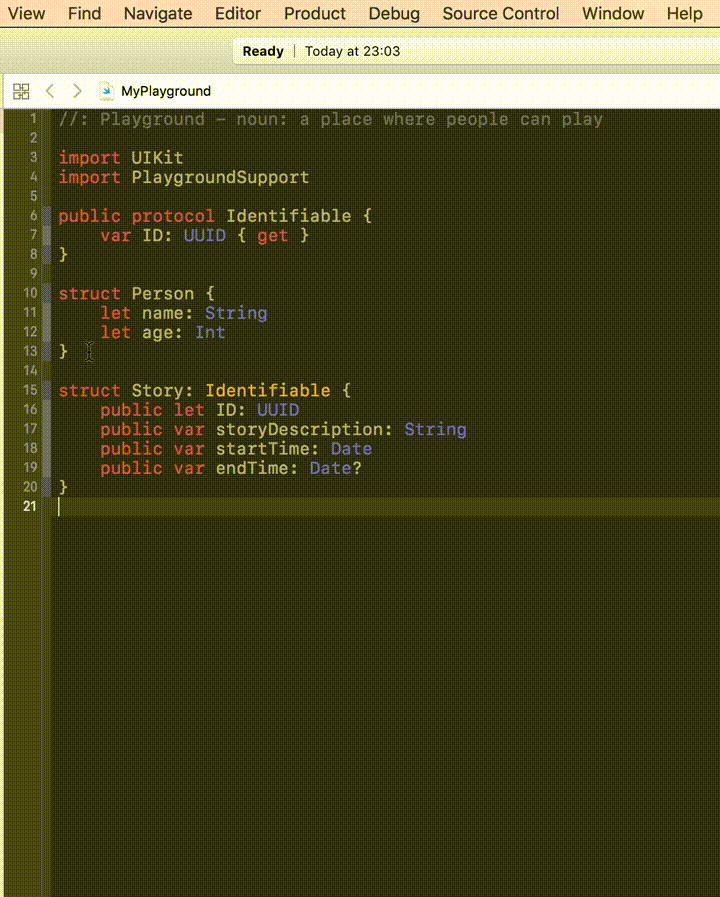

#Swift Equatable Generator

Xcode 8 Source Code Extension will generate conformance to [Swift Equatable](https://developer.apple.com/reference/swift/equatable) protocol based on type and fields selection. 

##Features:
- generates `Equatable` conformance for `struct` or `class`

##TODO:
- potential bug fixes
- add support for `enum`

##Example:

## Installation
1. Open Equitable.xcodeproj
2. Enable target signing for both the Application and the Source Code Extension using your own developer ID
3. Product > Archive
4. Right click archive > Show in Finder
5. Right click archive > Show Package Contents
6. Open Products, Applications
8. Equitable.app and exit.
9. Go to System Preferences -> Extensions -> Xcode Source Editor and enable the extension
10. The menu-item should now be available from Xcode's Editor menu.
